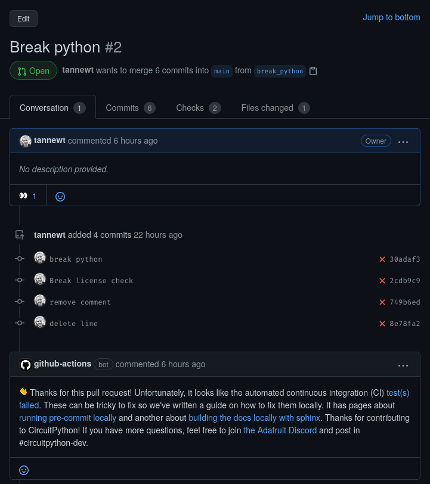

Introduction
============

[](https://discord.gg/adafruit)

This action posts a help comment about the CircuitPython Library CI checks to the related pull request. This is usually only done when a workflow run fails. (See the example workflow file below.)

The action reacts to the PR with eyes as a lock to prevent multiple posts. When the reaction is added, it will also post a comment with the help text. When the reaction already exists, the comment isn't posted.



Usage
=====

Place this in your GitHub repo's `.github/workflows` directory. (Typically named `failure-help-text.yml`.)

```yaml
# SPDX-FileCopyrightText: 2021 Scott Shawcroft for Adafruit Industries
#
# SPDX-License-Identifier: MIT

name: Failure help text

on:
  workflow_run:
    workflows: ["Build CI"]
    types:
      - completed

jobs:
  post-help:
    runs-on: ubuntu-latest
    if: ${{ github.event.workflow_run.conclusion == 'failure' }}
    steps:
    - name: Post comment to help
      uses: adafruit/circuitpython-action-library-ci-failed@v1

```

The text of the comment will be automatically update as the v1 tag of the action is updated.

Contributing
============

Contributions are welcome! Please read our [Code of Conduct](https://github.com/adafruit/Adafruit_CircuitPython_TestRepo/blob/master/CODE_OF_CONDUCT.md)
before contributing to help this project stay welcoming.
